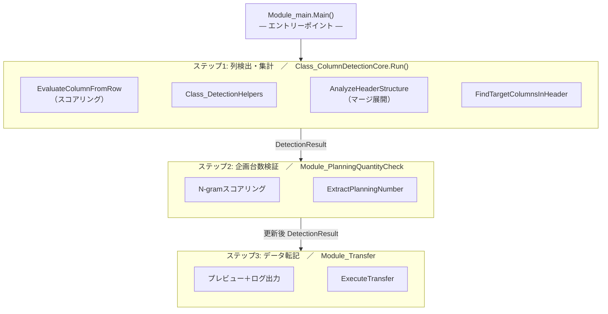

# 01. 社内帳票データ正規化ツール

> 「フォーマットがバラバラな調達契約書類」から、機種ごとの調達契約数・生産計画数を抽出・集計し、社内標準の「治具設備能力一覧表」へ自動転記する業務ツール。
>
> 列位置・ヘッダ階層・機種名表記が毎回異なる入力データを、スコアリングと正規化で吸収する。
>
> 治具設備の能力調査は、調達側（複数の取引先・部署）から送られてくるExcelをもとに、社内一覧表へ転記して管理している。

---

## 1. 概要

書式が毎回異なる調達契約書類を、列位置検出・ヘッダ展開・機種名正規化の3段で吸収し、社内標準の一覧表へ自動転記する。手作業では1件あたり数十分かかる照合・集計を、検証ステップ付きで自動化した。

---

## 2. 背景と課題

この資料には、現場運用上のあいまいな表記揺れがそのまま持ち込まれる。

- 同じ「調達契約数」「生産計画数」でも、**列位置・ヘッダ階層が書類ごとに違う**（マージ・段組み・別名表記）
- 機種名（部品名）の表記揺れが激しい（`670B STSL R` / `670B-STSL-R(US)` / `670B STSL L (対応01)` などがすべて同一機種）
- 「機種名列」が常にC列にあるとは限らず、**データ開始行も書類ごとに違う**
- 転記先の一覧表側も、ヘッダ名が完全一致するとは限らない（`調達契約数`／`契約数量` など）
- 企画台数の元値が別ファイル（生産設備見積シート）に分散しており、**ファイル名から該当ファイルを特定する必要がある**
- 1件あたり数十分の手作業が発生し、繁忙時は1回の依頼で20機種ほど処理する必要がある（年間平均10回程度）

「人が目で吸収していた表記揺れをロジックで吸収すること」「膨大なファイル群から該当ファイルを特定すること」「抽出データを正確に同機種行へ転記すること」の3点が要件だった。

---

## 3. 解決アプローチ

「決め打ちで列を指定しない」を出発点に、**検出 → 正規化 → 集計 → 検証 → 転記** の5段階に分解する。

- 列位置はスコアリングで検出（"部品名らしさ"を点数化して最高得点の列を採用）
- マージ構造を解析し、結合階層を保ったままヘッダ内容を取得・データ列との境界を認識
- 機種名は正規化処理を1本に集約（`Class_Normalizer`）し、表記揺れを吸収してからグループ化
- 企画台数は別ファイルから取得し、ファイル名をN-gram類似度で候補提示・ユーザー確認を挟む
- 共有ファイルを操作するため、転記前にプレビューとログを必ず出し、**実行前に止められる設計**にする

---

## 4. アーキテクチャ

### 4.1 全体構造

### 4.2 主要クラス・モジュールの責務

| 名前 | 種類 | 責務 |
| --- | --- | --- |
| `Class_ColumnDetectionCore` | クラス | 検出処理全体のオーケストレーション。`Run()` 1本で `DetectionResult` を返す |
| `Class_DetectionHelpers` | クラス | 正規化グルーピング／ヘッダ行検出／機種別平均計算の細部ロジック |
| `Class_Normalizer` | クラス | 機種名正規化の単一責任クラス |
| `DetectionResult` | クラス（DTO） | 検出処理の出力をまとめる構造体。後段全てがこれを受け取る |
| `Module_NGramScoring` | 標準モジュール | N-gram類似度計算 |
| `Module_PlanningQuantityCheck` | 標準モジュール | 企画台数検証。FSO/Workbook を引数注入してモック化対応 |
| `Module_Transfer` | 標準モジュール | 転記先検出と書き込み。マージセル詳細解析対応 |

---

## 5. 設計判断と意図

| 判断 | 採用した理由 | 検討した代替案 |
| --- | --- | --- |
| 列位置をスコアリングで検出 | 「部品名は3列目」と決め打つと書類が変わるたびに修正が必要になる。`正規化で変化＋部品名パターン一致＋末尾L/R` を加点する設計でヒューリスティックを点数化 | 固定列指定／ユーザーに毎回入力させる |
| マージヘッダを「全行複製」で展開 | 都度マージ判定だと後段の列検索が複雑になる。先に `headerData(col)(row)` の二次元辞書に展開しておけば、後段は単純なキー検索で済む | 都度マージ判定／結合範囲を都度展開 |
| `DetectionResult` を中間DTOにする | 検出→検証→転記の3段階で引数の数が爆発するのを防ぐ。後段は `result.modelStats` のように1点だけ見ればよい | 各処理で都度引数を渡す |
| 企画台数検証でN-gram類似度を使う | ファイル名と機種名が完全一致しないため。機種名がファイル名の一部に埋め込まれているケースを拾う必要がある | 完全一致検索／ワイルドカード |
| ユーザー確認を3回挟む（検証実行・候補選択・転記実行） | 「自動化＝全自動」ではなく、**判断はユーザーに残す**設計。誤転記のコストが高いため | 全自動実行 |
| `dictProvider` 等の引数注入でユニットテスト可能性を確保 | スコアリング・正規化・N-gramを純粋関数として切り出し、本体に「テストのための分岐」を入れずにテストできるようにした | テスト用ロジックを本体に混ぜる |

---

## 6. 処理フロー

### 6.1 列検出フェーズ

1. 全列×全行候補（1〜20列 × 1〜50行）を `EvaluateColumnFromRow` でスコアリング
2. 最高得点の `(列, 開始行)` を「機種名列・データ開始行」として採用
3. データ開始行の直上から、マージパターンでヘッダ範囲を推定し二次元辞書に展開
4. 展開後のヘッダから、ユーザー指定の `調達契約数 / 生産計画数` を含む列を検索
5. 機種名列を正規化グループ化し、機種ごとの平均値を `DetectionResult` に詰めて返す

### 6.2 企画台数検証フェーズ（任意）

1. 検索フォルダ配下の Excel ファイルを再帰収集
2. ファイル名を正規化してリスト化し、各機種名に対してN-gram類似度で候補を抽出
3. ユーザーが候補を順次確認（はい／いいえ／キャンセル＝手動選択）
4. 確定したファイルから企画台数を取得し、`DetectionResult.modelStats` を更新
5. 比較履歴を `PlanningComparisonHistory.txt` に保存

### 6.3 転記フェーズ

1. 転記先ファイルを開き、機種名列・能力列・企画列を検出
2. 元データと転記先の機種名を正規化してマッチング
3. プレビュー＋ログをユーザーに提示し、ログを確認してから転記実行
4. 結合セル対応の `WriteToCell` で書き込み
5. 上書き保存の確認後、ブックをクローズ

---

## 7. 学びと振り返り

- **「決め打ちを避ける」と「ユーザー判断を残す」のバランス**：自動化のうまみは検出・正規化にあり、最終判断は人が下す方が事故が少ない。3回の確認ダイアログは冗長に見えるが、誤転記のコストを考えると正解だった。
- **DTO（`DetectionResult`）の威力**：3フェーズが疎結合になり、企画台数検証をスキップする実装も数行で済んだ。最初は引数を10個近く渡していたが、DTO化で見通しが劇的に改善した。
- **正規化ロジックの一元化**：もとは長大な `Normalize` 関数があり、テストしづらく副作用が読めなかった。`Class_Normalizer` に切り出し、Test 専用ラッパーを設けることで、内部ロジックを壊さずユニットテストが書けるようになった。
- **N-gramは精度より「マッチ率」のほうが効く**：スコア値だけ見るとファイル名が長いほど有利になってしまうため、`commonTokens / modelTokens` のマッチ率を併用する設計に落ち着いた。

---

## 8. 使用技術

VBA / Excel オブジェクトモデル（結合セル・マージ範囲操作）/ Scripting.FileSystemObject / Scripting.Dictionary / VBScript.RegExp / WScript.Shell
