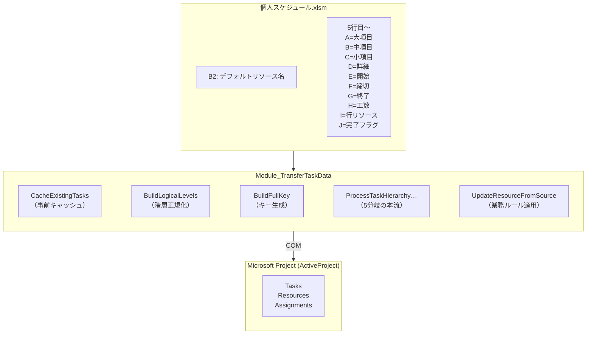
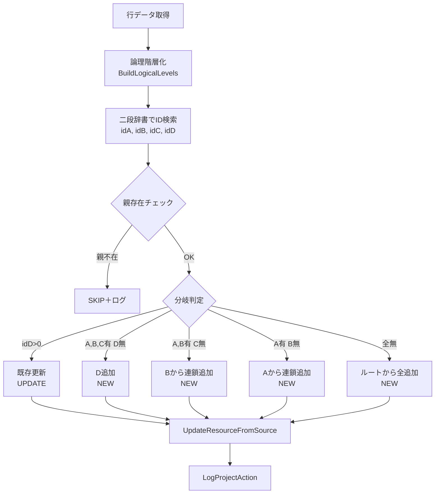

# 02. Excel→Project転記ツール

> Excel上で管理されている個人タスクスケジュールを、Microsoft Projectの全体工程表へ自動転記するツール。
>
> 階層構造の再現、既存タスクとの突合、外部委託リソースの業務ルール実装を担う「データ突合・整合性管理」の中核。

---

## 1. 概要

複数メンバーが個別Excelで管理するタスクを、論理階層への正規化と二段辞書による突合を経て、Microsoft Projectの全体工程表へ自動転記する。中抜け階層・二重登録・外部委託リソースの業務ルールを、転記処理側で吸収する。

---

## 2. 背景と課題

複数メンバーが個別のExcelブックでタスクを管理し、それを統合Project（.mpp）に集約する運用が存在していた。手作業転記には以下の問題があった。

- Excel側は **A〜D列の階層**（大項目→中項目→小項目→詳細）で表現されるが、**中抜け入力**（例：A→C→D）が常態化しており、機械的に「列＝階層」と扱えない
- 同一タスクが複数メンバーのブックに登場するため、**Project側に二重登録される事故**が発生していた
- 外部委託リソースは **社内リソースと混在不可**という業務ルールがあるが、ルール自体がドキュメント化されておらず、転記時の判断が属人化していた
- 過去にどのブックから転記されたかが追えず、**整合性検証が事実上不可能**
- Project COM操作はエラー発生時の挙動が予測しにくく、1件の失敗で全件処理が止まると業務影響が大きい

「Excelで集めてProjectで管理する」という運用そのものは崩せないため、**転記処理側で吸収する**設計が必要だった。

---

## 3. 解決アプローチ

「Excel側の表現揺らぎ」「Project側の制約」「業務ルール」を、それぞれ独立した層で処理する。

- 階層構造は **物理列（A〜D）ではなく論理レベル** に変換してから扱う
- 既存タスクは事前に **二段辞書（実体キー／4階層固定キー）にキャッシュ** し、毎回の線形検索を避ける
- 業務ルール（外部委託の排他、ブック履歴×リソース重複）は **判定関数として分離** し、本流ロジックから切り離す
- 1行のエラーで処理を止めず、**SKIP＋ログ継続** で全件処理を完遂させる

---

## 4. アーキテクチャ

### 4.1 全体構造



### 4.2 データ契約（入力Excel）

| セル位置 | 意味 | 備考 |
| --- | --- | --- |
| B2 | デフォルトリソース名 | 未入力時はエラー停止 |
| A列（5行目〜） | 大項目（論理Lv候補1） | 空欄可（ただし全列空ならSKIP） |
| B列 | 中項目（論理Lv候補2） | 空欄可（中抜け対応） |
| C列 | 小項目（論理Lv候補3） | 空欄可 |
| D列 | 詳細（論理Lv候補4） | 空欄可 |
| E列 | 開始日 | IsDate判定通過時のみ反映 |
| F列 | 締切日 | 同上 |
| G列 | 終了日 | 同上 |
| H列 | 工数（時間） | 数値かつ>0で `Work = h × 60`（分） |
| I列 | 行リソース名 | 空欄時はB2のデフォルトを採用 |
| J列 | 完了フラグ（"レ"） | "レ"の行は処理対象外 |

### 4.3 階層キーの設計

論理階層を「`A|B|C|D`」形式の固定長キーに正規化する。中抜けは詰めて上から積む。

```
入力       → 論理レベル        → fullKey
A=PJ1, B=設計, C=詳細, D=IF    → [PJ1, 設計, 詳細, IF]    → "PJ1|設計|詳細|IF"
A=PJ1, B=設計, C=,    D=レビュー → [PJ1, 設計, レビュー]    → "PJ1|設計|レビュー|"
A=PJ1, B=,    C=,    D=DR      → [PJ1, DR]                → "PJ1|DR||"
```

これにより「物理的にどの列に入っていたか」は捨てて、**論理的な親子関係だけで突合**できる。

---

## 5. 設計判断と意図

| 判断 | 採用した理由 | 検討した代替案 |
| --- | --- | --- |
| 論理階層への正規化（中抜け吸収） | 入力者の列選択ミスや書式運用のゆらぎを、突合ロジック側で吸収したい。物理列＝階層では1件のズレで親が見つからず破綻する | 物理階層固定／入力時バリデーションで弾く |
| 二段辞書（dictBase + dictFull） | 完全一致（実体キー）と階層位置一致（4階層固定キー）の両方が必要。1辞書では衝突する | 単一辞書／毎回 `projProj.Tasks` を線形走査 |
| 事前キャッシュ（`CacheExistingTasks`） | Project COMの `Tasks(n)` 参照はコストが高い。N行×M既存タスクの線形検索を避ける | 都度検索／部分キャッシュ |
| 親不在時はSKIP＋ログ | 「定義外の親子階層」は業務的にも要修正案件。**勝手に親を作らず、検知して記録**する方が後追いしやすい | 親を自動生成して通す |
| 外部委託リソースの排他 | 業務ルール上、外部委託タスクは社内リソースと混在不可。**社内→外部委託への切替時は既存を全削除して付け替え** | 警告のみで通す／一切混在不可で中断 |
| 行単位のエラーSKIP | 1件の失敗で100件の処理を巻き戻すのは業務影響が大きい。**全件処理してから失敗だけログで追う**方が現場で回る | 即時中断／トランザクション化 |
| 階層ロジックを Project COM から切り離してユニットテスト | `BuildLogicalLevels` / `BuildFullKey` は中抜けパターンの組み合わせ爆発が起きやすい。COM非依存でテストすることで本流改修時の安全性を担保 | 手動検証のみ |

---

## 6. 処理フロー

### 6.1 メイン処理（`TransferTaskData`）

1. アクティブシートとB2リソース名を取得（空ならエラー停止）
2. データ範囲（5行目〜最終行）を確定し、Microsoft Projectに接続
3. `CacheExistingTasks` で既存タスクを二段辞書に格納
4. 5行目から最終行まで、J列が"レ"でない行を `ProcessTaskHierarchyWithTracking` に渡す
5. 行ごとの成否を集計し、結果サマリをMsgBox表示・詳細はログファイルへ

### 6.2 行単位の階層処理（5分岐）



### 6.3 リソース更新の判定ツリー（`UpdateResourceFromSource`）

1. サマリタスクならスキップ（Project仕様上、サマリにリソース割当不可）
2. 既存リソースの「外部委託」グループ有無と、新規リソースのグループ名を判定
3. 判定の優先順位：
    - 既存が外部委託 ＆ 新規が社内 → スキップ（外部委託制約）
    - 既存が社内のみ ＆ 新規が外部委託 → **全削除して付け替え**
    - ブック履歴あり ＆ リソース重複 → スキップ（重複）
    - それ以外 → カンマ追記
4. メモ欄に転記履歴を「処理種別」付きで追記

---

## 7. 学びと振り返り

- **「物理構造」と「論理構造」を分けて考える経験**：Excel上の列＝階層という素朴な対応では、現場入力の揺らぎに耐えられない。**入力面の自由度は残したまま、突合面で正規化する**という発想を、設計レベルで実装に落とせた手応えがあった。
- **業務ルールをコードに落とす難しさ**：「外部委託リソースは社内と混在不可」というルールは、口頭では一行で済むが、コードに落とすと「既存／新規」「グループ判定」「置換か追記か」と4分岐になる。**業務ルールの粒度とコードの粒度は一致しない**ことを実感した。
- **「止めない」設計の価値**：行単位SKIPとログ継続は地味だが、現場では「100件中3件失敗、ログで原因が見える」状態が一番扱いやすい。**完璧な処理よりも、可観測な処理**を優先する判断を、自分の中で言語化できた。

---

## 8. 使用技術

VBA / Microsoft Project COM Automation / Scripting.Dictionary / VBA自前ユニットテスト
