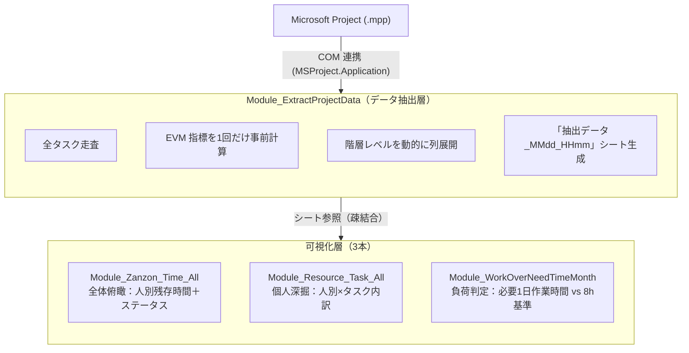

# 03. リソース負荷可視化ツール

> Microsoft Project の .mpp ファイルから WBS・進捗・EVM 指標を一括抽出し、
> 「誰が」「どのタスクに」「あと何時間」かかっているかを、組織視点と個人視点の双方からグラフ化する。
> 単なる集計ではなく、**遅延・遅延予兆を色で即時識別できる意思決定支援ツール**として設計。

---

## 1. 概要

Microsoft Project の .mpp から WBS・進捗・EVM 指標を抽出し、人別×タスク別の残工数・負荷状況・遅延予兆を可視化する。データ抽出層と可視化層を中間シートで疎結合にし、期間や切り口を変えながら何度でも可視化を試せる構造とした。

---

## 2. 背景と課題

設計部門のスケジュールはMicrosoft Project で一元管理されているが、現場での運用には以下の課題があった。

- Project の標準ビューでは **「個人ごとの今月の負荷」「遅延リスクのあるタスク」が一覧で見えない**
- マネージャーが負荷状況を把握するため、毎週手作業でフィルタ・集計を行っており時間がかかっていた
- EVM 指標（SPI / CPI / EAC など）は概念は知られていても、Project 上で**算出して可視化する手段が整っていなかった**
- 「実績開始日が入っていない」「点検日を過ぎている」など、**遅延の予兆を示す情報がタスクに散在**しており、属人的に判断されていた
- 集計対象期間（今月だけ／3ヶ月先まで など）が状況に応じて変わるため、固定レポートでは要件を満たせない

つまり「データはあるのに、意思決定に使える形に組み立て直すコストが高い」状態だった。

---

## 3. 解決アプローチ

データ抽出層と可視化層を分離し、**中間生成物（抽出データシート）を介した疎結合パイプライン**として設計した。

- MS Project からの抽出は1本（`Extract_ProjectData`）に集約。EVM 指標を含めた全データを正規化テーブルとして書き出す
- 可視化マクロは抽出データシートだけを入力源とする。Project への再アクセス不要
- 起算年月と必要期間を実行時に対話入力させ、**任意の集計ウィンドウ**に対応
- 遅延／遅延予兆を「赤／黄」で**グラフとセル背景の両方に反映**し、視認性を担保
- 外部委託リソースの除外、完了済みタスクの除外など、**業務ルールをコード側で吸収**

---

## 4. アーキテクチャ

### 4.1 全体構造

### 4.2 中間生成物（抽出データシート）の構造

| カテゴリ | 列例 | 役割 |
| --- | --- | --- |
| 階層情報 | レベル1〜N タスク、WBS番号、タスクID | サマリ階層を動的に展開 |
| リソース情報 | リソース名、リソースグループ | 個人軸の集計キー／外部委託判定 |
| 日付情報 | ベースライン開始/終了、予定、実績、期限、開発完了点検 | 遅延・遅延予兆判定の原データ |
| 工数情報 | 作業時間／基準計画／実績／残作業（時間換算） | 負荷集計・残存集計の原データ |
| 状態判定 | クリティカルパス、余裕期間、遅延判定 | 業務ルール組込み済みフラグ |
| EVM 指標 | SPI / CPI / EAC / VAC / TCPI / 必要生産性倍率 / 割当余地 | プロジェクト全体の健全性指標 |

抽出層で**業務ルールを織り込んだ正規化テーブル**を一度作ることで、可視化マクロ側は「集計と描画」に専念できる。

---

## 5. 設計判断と意図

| 判断 | 採用した理由 | 検討した代替案 |
| --- | --- | --- |
| 抽出層と可視化層を分離 | Project への接続コストが大きく、可視化のたびに再接続したくない。中間シートを挟むことで、ユーザーが期間や切り口を変えながら**何度でも可視化を試せる** | グラフ生成のたびに Project へ再アクセス |
| EVM 指標をループ前に事前計算 | 旧版ではタスク毎に再計算してボトルネック化していた。プロジェクト全体で1度だけ計算する形に変更し**O(N²) → O(N)** に削減 | タスク行ごとに計算 |
| 階層レベルを動的に列展開 | プロジェクトごとに WBS の深さが異なる。固定列にすると浅いプロジェクトで空列、深いプロジェクトで欠落が発生 | レベル1〜5の固定列 |
| 業務ルールを抽出/集計の入口で吸収 | 「外部委託は除外」「完了済みは除外」「工数未入力は8h扱い」を集計の入口で確定させ、後段ロジックを純粋な計算に保つ | 集計後にフィルタ |
| 土日除外＋祝日出勤の営業日カウント | 自社カレンダー（土日休・祝日稼働）に合わせて `NETWORKDAYS` を選択。**現場の働き方に整合した必要1日作業時間**を算出 | 単純な日数除算 |
| `Debug.Print` による全工程ログ | 抽出件数・計算結果・対象行を後追いできる可観測性を担保。サイレント失敗を防ぐ | MsgBox のみ |
| 遅延判定の境界条件をユニットテストでカバー | 点検日が過去／未来／空欄、残作業が0／未入力／通常値といった境界の塊。仕様変更時のリグレッションを機械的に検知できるようにした | 目視確認のみ |

---

## 6. 処理フロー

### 6.1 データ抽出（`Extract_ProjectData`）

1. `.mpp` ファイルをファイル選択ダイアログで指定し、`抽出データ_MMdd_HHmm` シートを生成
2. `MSProject.Application` に接続（既存インスタンスがあれば再利用）
3. 最大階層レベルを走査して、レベル1〜N の列を動的に作成
4. EVM 指標（SPI / CPI / EAC / VAC / TCPI）をプロジェクト全体で1度だけ計算
5. 全タスクを走査し、リソース割当の数だけ行を展開。空欄列・リソース空欄行を削除し、元のアクティブシートに復帰

### 6.2 全体俯瞰（`Zanzon_Time_All`）

1. 「抽出データ」を含むシートを自動検出し、起算年月・必要期間を対話入力
2. 対象タスクを抽出（実績終了済み・外部委託は除外）
3. 残作業時間を人別に集計しつつ、開発完了点検日を基準に判定：
   - 点検日 < 今日 → **遅れ**（赤）
   - 今日 + 必要日数 > 点検日 → **遅れそう**（黄）
4. 集計テーブルと棒グラフを生成。**棒の色・セル背景色・凡例（赤/黄シェイプ）** で状態を冗長表現

### 6.3 個人深掘（`Resource_Task_All`）

1. リソース別×タスクラベル別の2階層 Dictionary で集計
2. タスクラベルは「レベル1 / レベル2 / ... / 末端」をスラッシュ連結し**WBSの文脈ごと識別**
3. リソース単位でグラフを縦に並べ、遅れ・遅れそうのタスクを赤・黄でハイライト

### 6.4 負荷判定（`WorkOver_Need_Time_Month`）

1. 起算年月・必要期間から対象期間の営業日数を算出（`NETWORKDAYS`）
2. 人別の残作業時間合計 ÷ 営業日数 = **必要1日作業時間**
3. 棒グラフ（必要1日作業時間）＋折れ線（8時間基準）で**閾値超過を一目で識別**

---

## 7. 学びと振り返り

- **データ抽出と可視化の分離は正解だった**：可視化マクロは何度も書き直したが、抽出層を触らずに済んだ。「中間生成物の設計」が再利用性と保守性の両方を支える、ということを実感した。
- **業務ルールはコードの入口で吸収する**：途中の計算式に if を足していくと判定漏れと重複が混ざる。「対象/非対象」を入口で確定させると、後段の関数が驚くほどシンプルになる。
- **冗長な可視化は冗長ではない**：色・背景・凡例・テキストで同じ情報を複数経路で伝えることは、印刷物や非デジタル経路を含む実務では正義だった。
- **ユニットテストが境界条件の議論を引き出す**：「点検日が今日ちょうどの時はどうする？」という議論は、テストケースを書こうとして初めて生まれた。テストは仕様書でもあると気づいた。

---

## 8. 使用技術

VBA / Microsoft Project COM 連携（MSProject.Application）/ Scripting.Dictionary / WorksheetFunction.NetworkDays / ChartObjects / Shapes (AddShape / AddTextbox) / FormatConditions（カラースケール）
