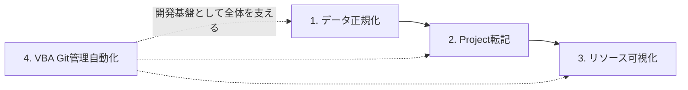

# 業務システム設計ポートフォリオ

エンドユーザーの課題を、自分で設計・実装して解決するエンジニアを目指しています。
本リポジトリは、現職（製造業）でのDX推進業務を通じて
独学で作成した業務ツール4本の設計思想をまとめたものです。

---

## はじめに 

自動車整備士として20年、その後プラント設計を2年経験したのち、
現職にてDX推進業務に携わった期間（2025/06〜2026/01）に、
プログラミングを独学で習得しました。メンター不在・OJTなしの環境で、
AI（主にClaude）を協業相手として活用しながら、「業務システムとして信頼に足るコードとは何か」を
自分なりに考えながら、業務課題の発見から
設計・実装・検証までを一人で回してきました。

現在は社内の人員配置に伴い別業務（設計補助）に従事していますが、
独学で築いた開発サイクルは試験勉強やPython学習として継続しています。

---

## なぜSEを目指すのか

DX推進業務を通じて、業務課題を観察し、構造を分解し、コードに落とし込み、動かし、検証するという仕事に手応えを感じました。この一連の流れは、整備士時代に故障車と向き合っていた時間や、プラント設計で図面を起こしていた時間と、感覚的に地続きでした。扱う対象が車・建造物・コードと形が変わっても、「動かないものの原因を切り分け、正しく動くまで手を入れる」という姿勢は自分の中で一貫しています。

一方で、独学とAI協業でここまで積み上げてきたなかで、一人で開発を続けることの限界も感じています。「動くコード」といっても、現場や用途によって適切な書き方は異なります。実運用の現場に身を置くことで、その場に応じた作法を学び、技術として定着させていきたいと考えています。

システムエンジニア／プログラマへの転身は、方向転換ではなく、エンジニアであり続けるための次のフィールドの選択だと考えています。プログラミング、システム運用・保守、Webのコーディングやメンテナンスといった領域に、腰を据えて取り組んでいきたいと考えています。

---

## 強み

### 1. エンドユーザーの課題を理解した上で、システムに落とし込める

自動車整備士として20年、プラント設計補助として2年の経験を経て、
現在は製造業の現場で複数の業務に従事しています。
整備の仕事を通じて「動かないものの原因を切り分けて、直るまで諦めない」姿勢が
身についており、これは業務システムの不具合解析・要件分解に直結しています。
表記揺れ・中抜け入力・属人化した業務ルールなど、
「人が目で吸収していた揺らぎ」をロジック側で吸収する設計を意識しています。

### 2. 自走力と自己改善ループ

独学・メンター不在の環境で、課題を検知し、自分で改善を重ねてきました。
「コード品質が不十分」と気づけばテスト・Gitを導入し、
「要件と成果物にズレが出た」と感じれば要件定義の重要性を学び直す、
というサイクルを継続しています。

### 3. 開発者文化の自発的な取り込み

ユニットテスト、Gitによる版管理、リファクタリング、ログ設計など、
独学の段階から開発プロセスを自分から取り入れてきました。
本ポートフォリオの第4章（VBA Git管理自動化ツール）は、
その姿勢が形になったものです。

### 4. AI協業時の品質担保の工夫

AI協業には課題もありました。AIによってコードを破壊された経験や、AIが規模の大きいコードを完結させきれない場面に何度も直面しています。この問題への対処を探す中でオブジェクト指向設計やリファクタリングという領域に行き着きました。クラスやモジュール単位でのユニットテストによるバグの早期発見、Gitでのバージョン管理によるコード品質担保を積極的に導入しました。結果として、AI起因のトラブルを大幅に減らし、完走させられる事が可能になりました。

---

## 技術スタック

### 実務で使用（DX推進業務 2025/06〜2026/01）

- **VBA**：業務ツール4本を独学で設計・実装。クラスモジュール／DTO／ユニットテスト／スコアリング検出など
- **Git**：VBAコードの版管理を自動化（第4章）

### 学習中

- **Python**：業務自動化への適用を見据えて独学中
- **基本情報技術者試験**：業務システム設計の知識を体系化するため受験準備中

---

## 成果物

現職での業務を通じて作成した業務ツール4本の設計思想を、
本リポジトリに章立てでまとめています。コード本体は業務利用のため非公開ですが、
設計判断・アーキテクチャ・処理フロー・学びを各章で詳述しています。

| # | ツール名 | 概要 | 証明する能力 |
|---|---------|------|-------------|
| 1 | [社内帳票データ正規化ツール](./01_normalizer.md) | 表記揺れ・列位置揺れ・マージ階層を吸収し、社内標準フォーマットへ自動転記 | データの正規化・構造化 |
| 2 | [Excel→Project転記ツール](./02_excel_to_project.md) | Excel上の階層タスクをMS Projectへ転記。中抜け階層・重複・業務ルールを吸収 | データ突合・整合性管理・業務ルール実装 |
| 3 | [リソース負荷可視化ツール](./03_resource_visualizer.md) | MS Projectから工数・EVM指標を抽出し、負荷状況を組織／個人視点で可視化 | 要件分解・データ可視化・意思決定支援 |
| 4 | [VBA Git管理自動化ツール](./04_vba_git_automation.md) | 保存トリガーでVBAソースを自動エクスポート＆コミット。開発基盤を整備 | 開発プロセスの設計・環境整備 |

### 4本の関係性

```mermaid
graph LR
    A[1. データ正規化] --> B[2. Project転記]
    B --> C[3. リソース可視化]
    D[4. VBA Git管理自動化] -.->|開発基盤として全体を支える| A
    D -.-> B
    D -.-> C
```

1〜3は業務フローの上流から下流をカバーするパイプライン、
4はそれら全体の開発基盤として機能する構成です。

---

## 自己認識として

IT実務経験は8ヶ月で、説明・要件すり合わせの面ではまだ伸びしろがあります。
こういった面は今後の自己学習や、実務経験を積むことで補強できると考えています。

一方で、課題を検知して自分で修正を重ねるサイクルは、
独学期間を通じて自分の中に定着したものです。
新しい環境でも、この方法を用いて伸びていけると考えています。

---

## 目指す方向性

エンドユーザー目線を起点に、設計・実装・データ活用までを一気通貫で担えるエンジニアを目指しています。

---